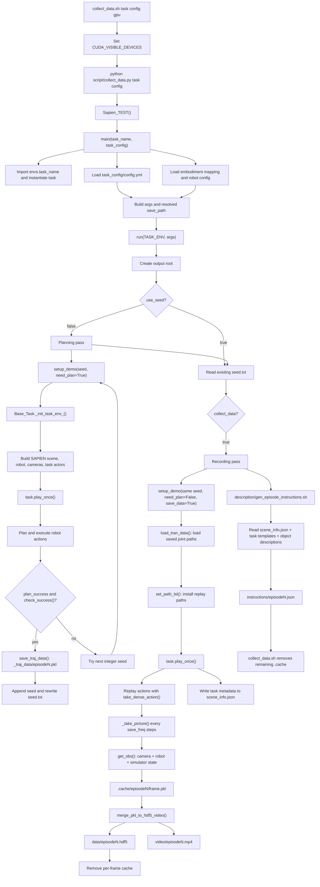

# `collect_data.sh` Process and Data Provenance

This note traces:

```bash
bash collect_data.sh <task_name> <task_config> <gpu_id>
```

Example:

```bash
bash collect_data.sh adjust_bottle randomized_1 0
```

All relative paths below are resolved from the shell's current working
directory. The intended working directory is the repository root.

## High-Level Flow

The collector runs each successful episode in two passes:

1. **Planning pass**: create a randomized scene, run the task planner, verify
   success, and save the generated joint trajectories.
2. **Recording pass**: recreate the same scene from the successful seed,
   replay the saved trajectories, sample simulator observations, and convert
   them to HDF5 and video.

After all episodes are recorded, a third process creates language instructions
from task templates and episode metadata.



## Shell Entrypoint

File: `collect_data.sh`

1. Positional arguments become `task_name`, `task_config`, and `gpu_id`.
2. `CUDA_VISIBLE_DEVICES` selects the GPU visible to Python.
3. Python is started with:

   ```bash
   python script/collect_data.py "$task_name" "$task_config"
   ```

4. After Python exits, the shell removes:

   ```text
   data/<task_name>/<task_config>/.cache
   ```

This cleanup path is hard-coded. It does not use `save_path` from the YAML, so
it targets the wrong directory if collection is configured outside `./data`.

The script currently calls `./script/.update_path.sh`, but that file is not
present in this checkout. Its stdout and stderr are redirected and the shell
does not use `set -e`, so this failed command does not stop collection.

## Python Initialization

Entry point: `script/collect_data.py:236`

```text
__main__
  -> Sapien_TEST()
  -> multiprocessing.set_start_method("spawn")
  -> parse task_name and task_config
  -> main(task_name, task_config)
```

`Sapien_TEST()` performs a renderer/environment check before collection.

### Task Class

`class_decorator(task_name)` dynamically imports:

```python
envs_module = importlib.import_module(f"envs.{task_name}")
env_class = getattr(envs_module, task_name)
env_instance = env_class()
```

For `adjust_bottle`, this resolves to:

```text
envs/adjust_bottle.py
  -> class adjust_bottle(Base_Task)
```

The subclass defines the task-specific parts:

- `setup_demo()`: forwards configuration to `Base_Task._init_task_env_()`.
- `load_actors()`: selects and places task objects.
- `play_once()`: defines the scripted task action sequence.
- `check_success()`: determines whether the final simulator state is valid.

## Configuration Sources

### Task Configuration

`main()` loads:

```text
task_config/<task_config>.yml
```

For the example command:

```text
task_config/randomized_1.yml
```

This is the source of:

- `episode_num`
- `use_seed`
- `save_freq`
- `embodiment`
- `language_num`
- domain-randomization settings
- camera selection
- fields enabled in `data_type`
- point-cloud settings
- initial `save_path`
- cache-clearing frequency
- whether data and videos are collected

The output path is expanded at `script/collect_data.py:102`:

```python
args["save_path"] = os.path.join(
    args["save_path"],
    args["task_name"],
    args["task_config"],
)
```

With `save_path: ./data`, the example becomes:

```text
./data/adjust_bottle/randomized_1
```

`os.makedirs(..., exist_ok=True)` creates it at
`script/collect_data.py:112`.

### Robot Configuration

The selected embodiment name is mapped through:

```text
task_config/_embodiment_config.yml
```

For `aloha-agilex`, this points to:

```text
assets/embodiments/aloha-agilex/
```

The collector then loads:

```text
assets/embodiments/aloha-agilex/config.yml
```

That file supplies URDF/SRDF paths, joint names, gripper parameters, home
state, planner type, robot pose, and static camera placement.

`Robot._init_robot_()` loads the URDF into SAPIEN and initializes the robot
joints and planners.

### Camera Configuration

Camera placement comes from the embodiment's `static_camera_list`.
Resolution and field of view come from:

```text
task_config/_camera_config.yml
```

`Camera.load_camera()` creates SAPIEN cameras for enabled head/wrist cameras
and other configured static cameras.

### Object Assets

The task chooses object categories and model IDs in its `load_actors()`.
For example, `adjust_bottle.load_actors()` selects model 13 or 16 from:

```text
assets/objects/001_bottle/
```

`rand_create_actor()` and the actor creation helpers load meshes, collision
geometry, and model metadata from that directory.

## Pass 1: Seeds and Pre-Motion Trajectories

Entry point: `run()` at `script/collect_data.py:106`.

The planning pass sets:

```python
args["need_plan"] = True
```

It tries integer seeds until `episode_num` successful episodes are found.

### Scene Creation

For each attempted seed:

```text
TASK_ENV.setup_demo(now_ep_num=suc_num, seed=epid, **args)
  -> task.setup_demo()
  -> Base_Task._init_task_env_(**args)
```

`_init_task_env_()`:

1. Seeds NumPy and Torch.
2. Copies configuration into fields such as `self.save_dir`,
   `self.save_freq`, and `self.data_type`.
3. Creates the SAPIEN physics/rendering scene.
4. Randomizes lighting, table height, camera displacement, textures, and
   clutter according to the YAML file.
5. Creates the table and wall.
6. Loads the robot and motion planner.
7. Loads the cameras.
8. Calls the task's `load_actors()` to create randomized task objects.
9. Checks that the initialized objects are physically stable.

Because the same seed is reused in pass 2, NumPy- and Torch-driven scene
choices should be reproduced. Python's `random.seed()` call is commented out,
so code paths using the standard `random` module are not guaranteed to replay
identically.

### Planning and Execution

`TASK_ENV.play_once()` is task-specific. For `adjust_bottle`, it calls:

```text
grasp_actor()
move_by_displacement()
place_actor()
```

These helpers construct `Action` objects. Then:

```text
Base_Task.move()
  -> left_move_to_pose() / right_move_to_pose()
  -> Robot.left_plan_path() / Robot.right_plan_path()
  -> append planner result to left_joint_path/right_joint_path
  -> take_dense_action()
  -> set robot joints and step the SAPIEN scene
```

In this pass, observations are not persisted because `save_data` is still
false. The collector is finding a successful scene seed and a valid planned
motion.

### Planning Outputs

An attempt is accepted only when:

```python
TASK_ENV.plan_success and TASK_ENV.check_success()
```

For each accepted episode:

```text
seed.txt
_traj_data/episodeN.pkl
```

`seed.txt` stores the successful random seeds.

`_traj_data/episodeN.pkl` stores:

```python
{
    "left_joint_path": [...planner results...],
    "right_joint_path": [...planner results...],
}
```

The saved planner results contain arm positions, velocities, and status.
Gripper interpolation is recalculated from the recreated robot state while
`play_once()` is replayed.

## Pass 2: Observation Recording

Before recording, `run()` changes:

```python
args["need_plan"] = False
args["render_freq"] = 0
args["save_data"] = True
```

For each episode:

```text
setup_demo(same successful seed)
  -> recreate scene, robot, cameras, and objects
load_tran_data(episode_idx)
  -> read _traj_data/episodeN.pkl
set_path_lst(args)
  -> install saved left/right joint paths
play_once()
  -> run the same task program
  -> consume saved trajectories instead of calling the planner
```

### Sampling Trigger

`move()` eventually calls `take_dense_action()`.

`take_dense_action()`:

1. Applies arm positions/velocities and gripper commands.
2. Advances SAPIEN with `self.scene.step()`.
3. Calls `_take_picture()` every `save_freq` control steps, including
   boundary frames.

`save_freq` therefore controls temporal downsampling of simulator control
steps, not camera FPS.

### Where Each Frame Comes From

`_take_picture()` calls `get_obs()`. Each frame is generated from the current
SAPIEN simulator state:

| Output field | Source |
| --- | --- |
| Camera RGB | SAPIEN camera render buffers via `Camera.get_rgb()` |
| Camera intrinsics | SAPIEN camera via `get_intrinsic_matrix()` |
| Camera extrinsics | SAPIEN camera via `get_extrinsic_matrix()` |
| Camera-to-world matrix | SAPIEN camera via `get_model_matrix()` |
| Depth, if enabled | SAPIEN `Position` render buffer |
| Segmentation, if enabled | SAPIEN `Segmentation` render buffer |
| Point cloud, if enabled | Camera position/color buffers transformed to world coordinates |
| Left/right arm qpos | Current robot articulation joint state |
| Left/right gripper | Current normalized gripper state |
| End-effector poses | Current robot end-effector poses in the simulator |

The enabled fields are controlled by `data_type` in the task YAML.

For `randomized_1.yml`, the main enabled payload is:

```text
observation/<camera>/rgb
observation/<camera>/intrinsic_cv
observation/<camera>/extrinsic_cv
observation/<camera>/cam2world_gl
joint_action/*
endpose/*
```

Despite its name, `joint_action` is populated from the current robot joint
state at sampling time.

Each sampled frame is first written to:

```text
.cache/episodeN/0.pkl
.cache/episodeN/1.pkl
...
```

### Episode Metadata

The task's `play_once()` returns `self.info`.

Base initialization adds:

- cluttered object information
- wall and table texture information

The task adds semantic placeholders. For `adjust_bottle`:

```python
{
    "{A}": "001_bottle/base<model_id>",
    "{a}": "<left-or-right>",
}
```

This is stored under:

```text
scene_info.json -> episode_N
```

It is metadata for language generation, separate from the HDF5 observations.

## PKL to HDF5 and Video

After an episode finishes:

```text
Base_Task.merge_pkl_to_hdf5_video()
  -> process_folder_to_hdf5_video()
  -> sort and validate numbered frame PKLs
  -> aggregate each nested field over time
  -> JPEG-encode RGB arrays
  -> write HDF5 datasets
  -> pass head-camera RGB frames to ffmpeg
```

Outputs:

```text
data/episodeN.hdf5
video/episodeN.mp4
```

The MP4 is derived only from:

```text
observation/head_camera/rgb
```

After conversion, `remove_data_cache()` deletes that episode's frame PKLs.

## Language Instruction Generation

After all requested episodes are processed:

```text
script/collect_data.py
  -> cd description
  -> bash gen_episode_instructions.sh task config language_num
  -> python utils/generate_episode_instructions.py
```

The language generator combines three data sources:

1. Episode placeholders from:

   ```text
   data/<task>/<config>/scene_info.json
   ```

2. Task instruction templates from:

   ```text
   description/task_instruction/<task>.json
   ```

3. Object descriptions from paths such as:

   ```text
   description/objects_description/001_bottle/base13.json
   ```

It replaces placeholders such as `{A}` and `{a}` and writes:

```text
instructions/episodeN.json
```

Each file contains `seen` and `unseen` language variants.

The instruction output directory is hard-coded to:

```text
data/<task>/<config>/instructions
```

The scene-info reader uses the YAML `save_path`, but the instruction writer
does not. A custom `save_path` can therefore split observations and generated
instructions across different roots.

## Final Output Layout

For the example command:

```text
data/adjust_bottle/randomized_1/
├── seed.txt
├── scene_info.json
├── _traj_data/
│   └── episode0.pkl
├── data/
│   └── episode0.hdf5
├── video/
│   └── episode0.mp4
└── instructions/
    └── episode0.json
```

Temporary files are stored under `.cache/` and should be deleted after
successful conversion.

## Data Provenance Summary

```text
Command-line arguments
  -> task name, config name, GPU

task_config/<config>.yml
  -> collection size, randomization, cameras, fields, save path

task_config/_embodiment_config.yml
  -> embodiment name to asset directory

assets/embodiments/<embodiment>/config.yml + URDF/SRDF
  -> robot model, joints, planner, camera poses

envs/<task>.py
  -> object selection, scene arrangement, action program, success test,
     semantic episode metadata

assets/objects/*
  -> object geometry, collision data, and physical/model metadata

successful integer seed
  -> reproducible NumPy/Torch-driven scene choices

motion planner
  -> left/right arm joint trajectories

task action helpers
  -> gripper interpolation recalculated during each pass

SAPIEN simulation
  -> physics state, camera images, depth/segmentation, robot state and poses

description/task_instruction/* + description/objects_description/*
  -> natural-language instructions
```

## Resume Behavior and Missing-Trajectory Failure

The resume logic treats the number of entries in `seed.txt` as the number of
completed planning episodes:

```python
suc_num = len(seed_list)
```

It does not verify that every corresponding file exists:

```text
_traj_data/episodeN.pkl
```

It separately skips recording episodes while their HDF5 files exist.

Therefore, these files form an implicit consistency chain:

```text
seed.txt entry N
  -> _traj_data/episodeN.pkl
  -> data/episodeN.hdf5
```

If a run is interrupted or files are removed independently, the directory can
contain `seed.txt` but no trajectory. The planning loop then skips that
episode, and the recording pass fails in `load_tran_data()` with a missing
path.

For a fresh rerun of an incomplete configuration, remove that configuration's
output directory so all three stages are regenerated together:

```bash
rm -rf data/<task_name>/<task_config>
bash collect_data.sh <task_name> <task_config> <gpu_id>
```
